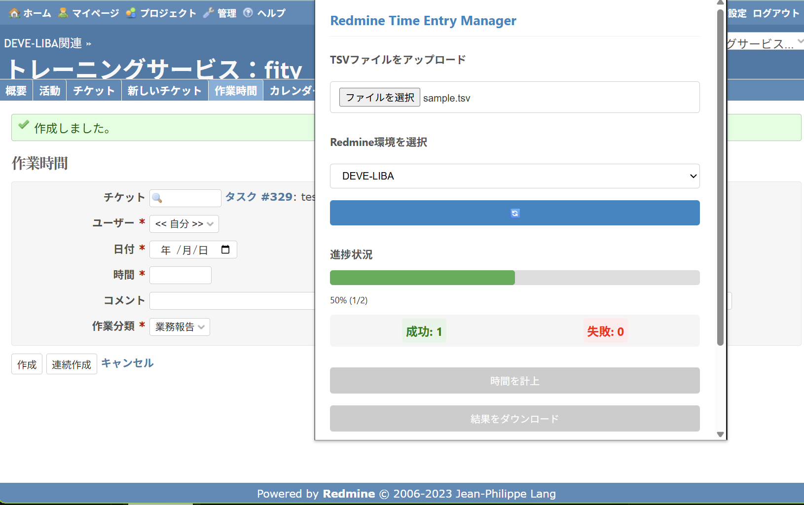
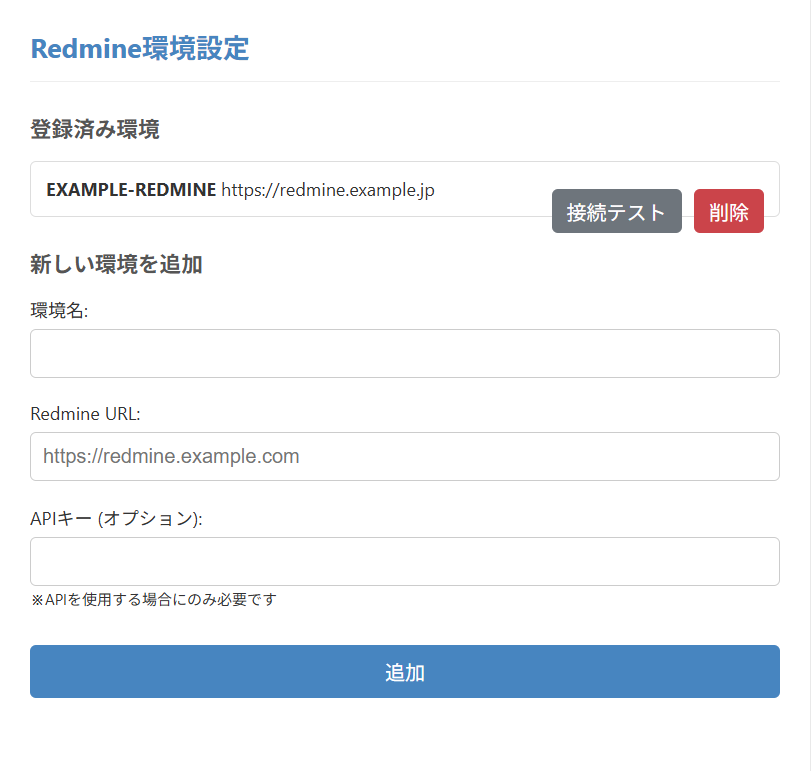

# Redmine Time Entry Manager

このChrome拡張機能は、複数のRedmine環境での時間計上を自動化するためのツールです。ブラウザでの操作を自動化して時間計上を行います。

## 主な機能

- 複数のRedmine環境に対応
- Redmine環境ごとにプロジェクトのURLを保存
- TSVファイルによる一括時間計上（ブラウザで自動入力）
- 処理結果のダウンロード機能

## 画面イメージ

実行画面  


設定画面  


## 使い方

1. 拡張機能をインストール後、環境設定からRedmine環境を登録します
2. ポップアップから時間計上したいRedmine環境を選択します
3. TSVファイルをアップロードします
4. 「時間を計上」ボタンをクリックします
5. 現在のタブで自動的に時間が計上されていきます
6. 処理が完了したら「結果をダウンロード」ボタンから結果をダウンロードできます

※ブラウザでの自動入力を行うため、処理中はタブを閉じたり操作したりしないでください

## TSVファイルの形式

TSVファイルは以下の項目を含む必要があります：

- プロジェクトID (数値、名前、または識別子)
- 日付 (YYYY-MM-DD形式)
- チケットID (数値)
- 担当者 (IDまたは名前)
- 時間 (数値)
- 作業分類 (IDまたは名前)
- コメント

※ TSVファイルはUTF-8エンコーディングで、改行コードはLFまたはCRLFを使用できます

例：
```
プロジェクトID	日付	チケットID	担当者	時間	作業分類	コメント
100	2023-06-01	1234	山田太郎	2.5	開発	機能実装
development	2023-06-02	5678	42	1.0	10	
```

注: プロジェクトIDには数値ID、プロジェクト名、またはプロジェクト識別子を使用できます。

## インストール方法

1. リポジトリをクローンまたはダウンロードします
2. Chromeの拡張機能ページ(chrome://extensions/)を開きます
3. 「デベロッパーモード」を有効にします
4. 「パッケージ化されていない拡張機能を読み込む」をクリックします
5. ダウンロードしたフォルダを選択します

## 必要な権限について

この拡張機能は以下の権限を必要とします：

- `storage`: 設定を保存するため
- `tabs`: Redmineのタブを開いて操作するため
- `downloads`: 結果ファイルをダウンロードするため
- `scripting`: ブラウザでのフォーム操作を自動化するため
- `host_permissions`: Redmineサイトにアクセスするため

## ライセンス

MIT License
